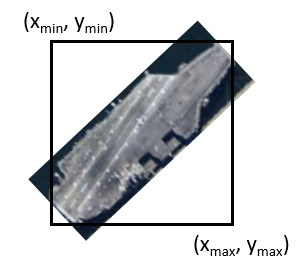
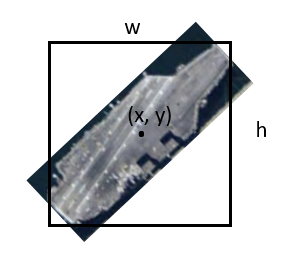
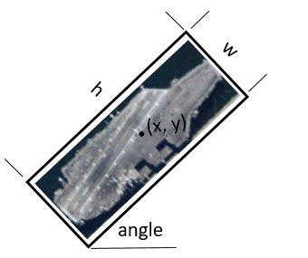
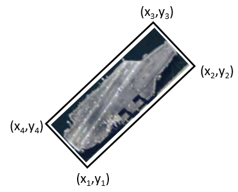
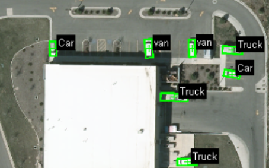
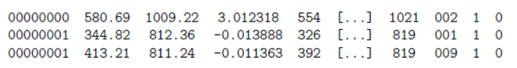

# Object Detection Datasets

# 1. Overview
This repo briefly introduced the targets, images, annotations, popular benchmark, and datasets of remote sensing object detection.

## Typical targets
- **general facilities**: airport, harbor, ground track field, basketball court, storage tank, bridge,... 
- **special facilities**: battle field, ... 
- **general targets**: ship, aircraft, ... 
- **special targets**: search and rescue target, aircraft carrier, T62, BTR_70, ... 

## Image sources
- Optical (MSS)
  - space-based 
    - Google Earth: ~level 15 - level 20  
    - worldview: ~ 0.3m - *
    - GaoFen: ~ 0.6m - 50m
    - ...
  - air-based
    - ~ 0.01m - 1m
- Imaging radar (SAR)
  - space-based
    - GaoFen3: ~ 1m - 10m
  - air-based
- Non imaging radar

## Annotation types
General annotation types includes: Horizontal B-Box(HBB), Oriented B-Box(OBB), instance segmentation, diamond style, CEDAI, key point, and so on. 
- **Horizontal B-Box(HBB)** 
  - (xmin, ymin, xmax, ymax) 
     
  - (xcenter, ycenter, width, height) 
     
  - ...
- **Oriented B-Box(OBB)** 
  - (xcenter, ycenter, width, height, angle) 
     
  - (x1, y1, x2, y2, x3, y3, x4, y4) 
     
  - ...
- **instance segmentation** 
  - ...
- **diamond style** 
    Used in RarePlane dataset. Each aircraft is labeled in a diamond style with annotators instructed to label the nose, left-wing, tail, and right-wing in order. This annotation style has the advantage of being simplistic, easily reproducible, convertible to a bounding box, and ensures that aircraft are consistently annotated as other formats can often lead to imprecise labeling. Furthermore, this annotation style enables us to pull out two valuable features of aircraft: Their length and wingspan. 
     

- **VEDAI** 
  Used in VEDAI dataset. The annotation contains the image ID, the coordinates of the center in the image, the orientation of the vehicle, the 4 coordinates of the 4 corners, the class name, a flag stating if the target is entirely contained in the image, a flag stating if the vehicle is occluded. 
   
   

# 2. Benchmarks and contests
## Popular benchmarks
- DOTA
- FAIR1M
- ...
## Hot contests
TODO

# 3. Datasets by category
## ship
### Optical
- in multi-class 
  - DOTA
  - NWPU VHR-10
- as single class 
  - HRSC2016
- finely classified 
### SAR
- 

# 3. Datasets by year: Public datasets

## Optical
| Dataset     | Categories | Images | Image width | Instances | Annotation |   Source    | Year | Available |
|:-----------:|:-------:|:--------:|:-------------:|:-----------:|:--------------:|:-----------:|:-----:|:----:|
| RSOD        | 4       | 976      |               | 6950        | HBB  | Google Earth, Tianditu |      | yes |
| SaRNet       | 1       | 2552     | 1000         | 4206        | HBB  | ~ 0.5m                | 2021  | yes |
| RarePlanes  |10 attributes| 253      |    512        | 14700   | diamond |WorldView3 0.31,1.24m| 2020 | yes |
| NWPU VHR-10 | 10      | 800      | ~1000         | 3775        | HBB  | Google Earth           | 2016 |yes |
| COWC        | 1       | 53       | 2000~19,000   | 32716       | VEDAI|    0.15m               | 2016 |yes |
| HRSC2016    | 1       | 1070     | ~1100         | 2976        | OBB  | Google Earth ~1m       | 2016 |yes |
| VEDAI       | 9       | 1210     | 512,1024      | 3640        | OBB  | Google Earth           | 2015 |yes |
| UCAS-AOD    | 2       | 910      | ~1000         | 6029        | OBB  | Google Earth           | 2015 |yes |
|DLR 3K Vehicle| 20     | 20       | 5616         | 14235       | OBB  | Google Earth           | 2015 |yes |
| DOTA        | 15      | 2806     | 800~4000      | 118,282     | oriented BB    |
| xView       | 60      | 1128     |               | ~1,000,000  | horizontal BB  |
| DIOR        | 20      | 23463    | 800           | 190,288     | horizontal BB  |
### 2022
### 2021
- [**SaRNet: Satellite Imagery for Search And Rescue Dataset**](https://github.com/michaelthoreau/SearchAndRescueNet) 
**Categories**:target 
**Description**:This is a single class dataset consisting of tiles of satellite imagery labeled with potential 'targets'. Labelers were instructed to draw boxes around anything they suspect may a paraglider wing, missing in a remote area of Nevada. Volunteers were shown examples of similar objects already in the environment for comparison. The missing wing, as it was found after 3 weeks, is shown below. 
 
**Reference**: 
[SaRNet: A Dataset for Deep Learning Assisted Search and Rescue with Satellite Imagery](https://arxiv.org/pdf/2107.12469.pdf) 
[Download link](https://michaeltpublic.s3.amazonaws.com/sarnet.zip) 
### 2020
- [**RarePlanes**](https://www.cosmiqworks.org/rareplanes-public-user-guide/) 
**Categories**:10 fine grain attributes including: aircraft length, wingspan, wing-shape, wing-position, FAA wingspan class, propulsion, number of engines, number of vertical-stabilizers, if it has canards, and aircraft role. 
**Description**:RarePlanes is a unique open-source machine learning dataset that incorporates both real and synthetically generated satellite imagery from Maxar and AI.Reverie. The real portion of the dataset consists of 253 Maxar WorldView-3 satellite images spanning 112 locations with ~14,700 hand annotated aircraft. The accompanying synthetic dataset is generated via AI.Reverie’s simulation platform and features 50,000 synthetic satellite images with over 600,000 aircraft annotations.  
**Reference**: 
All aircraft sketches are attributable to Wikipedia user Steelpillow: https://commons.wikimedia.org/wiki/User:Steelpillow/Aircraft 
### 2016
- **NWPU VHR-10** 
**Categories**:  airplane, ship, storage tank, baseballdiamond, tennis court, basketball court, ground track field, harbor, bridge,and vehicle 
**Description**: 
**Reference**: 
[Learning Rotation-Invariant Convolutional Neural Networks for Object Detection in VHR Optical Remote Sensing Images](https://ieeexplore.ieee.org/document/7560644) 
[Download link](https://1drv.ms/u/s!AmgKYzARBl5cczaUNysmiFRH4eE) 
- [**COWC(Cars Overhead With Context)**](https://gdo152.llnl.gov/cowc/) 
**Categories**: car 
**Description**:The Cars Overhead With Context (COWC) data set is a large set of annotated cars from overhead. It is useful for training a device such as a deep neural network to learn to detect and/or count cars.  
**Reference**: 
[A Large Contextual Dataset for Classification, Detection and Counting, of Cars with Deep Learning](https://gdo152.llnl.gov/cowc/mundhenk_et_al_eccv_2016.pdf) 
[Download link](ftp://gdo152.ucllnl.org/pub/cowc/) 
- [**HRSC2016(High resolution ship collections 2016)](https://www.kaggle.com/datasets/guofeng/hrsc2016)** 
**Categories**: ship 
**Description**:High resolution ship collections 2016 (HRSC2016) is a data set used for scientific research. Currently, all of the images in HRSC2016 were collected from Google Earth. 
**Reference**: 
[Ship Rotated Bounding Box Space for Ship Extraction From High-Resolution Optical Satellite Images With Complex Backgrounds](http://159.226.21.68/bitstream/173211/14544/1/Ship%20Rotated%20Bounding%20Box%20Space%20for%20Ship%20Extraction%20from%20High-Resolution%20Optical%20Satellite%20Images%20with%20Complex%20Backgrounds.pdf) 
[Download link](https://www.kaggle.com/datasets/guofeng/hrsc2016) 
### 2015
- **VEDAI** 
**Categories**:9 different classes of vehicles, includs ‘plane’, ‘boat’, ‘camping car’, ‘car’, ‘pick-up’,‘tractor’, ‘truck’,‘van’, and the ‘other’. 
**Description**: 
The annotation contains the image ID, the coordinates of the center in the image, the orientation of the vehicle, the 4 coordinates of the 4 corners, the class name, a flag stating if the target is entirely contained in the image, a flag stating if the vehicle is occluded. 
**Reference**: 
- **UCAS-AOD** 
**Categories**: 
**Description**: 
**Reference**: 
Zhu, H., Chen, X., Dai, W., Fu, K., Ye, Q., Jiao, J., 2015. Orientation robust object detection in aerial images using deep convolutional neural network, in: 2015 IEEE International Conference on Image Processing (ICIP), IEEE. pp. 3735–3739. 
[Download link]() 
- **DLR 3K Vehicle** 
Liu, K., Mattyus, G., 2015. Fast multiclass vehicle detection on aerial images. IEEE Geoscience and Remote Sensing Letters 12, 1938–1942. 
## SAR

## Multi-Modal

# 4. Private datasets (limited usage license)
TODO 

# 5. Dataset tools
- [DOTA_devkit](https://github.com/CAPTAIN-WHU/DOTA_devkit): Official DOTA dataset process code.
- [Remote-Sensing-Datasets](https://github.com/lawsonk16/Remote-Sensing-Datasets): DOTA, FAIR1M, xView process code.
